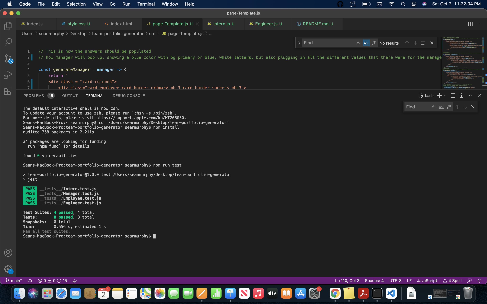
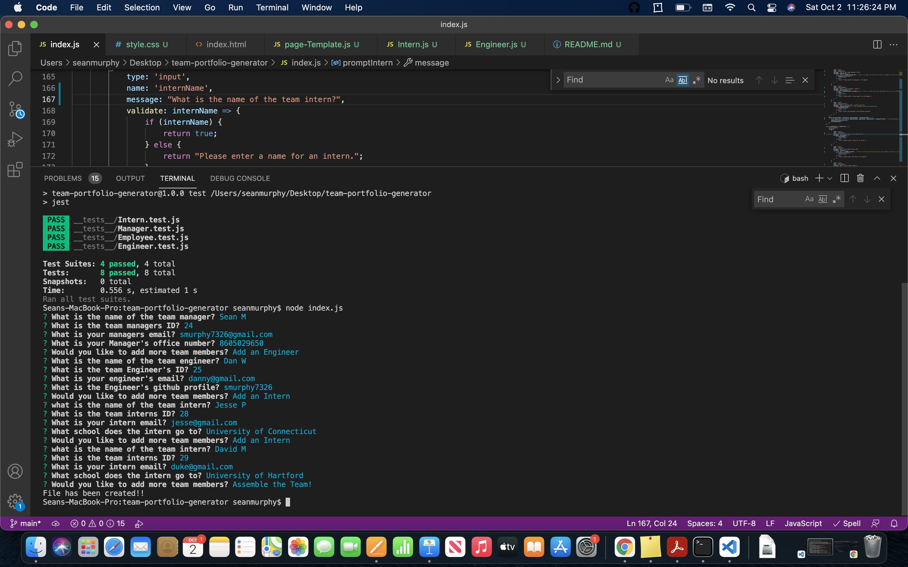
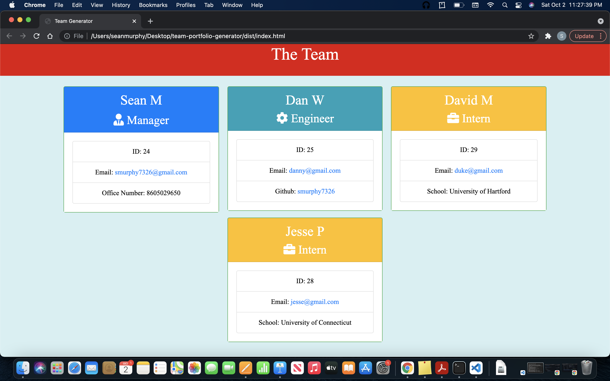

# Team Generator

## Description

This application was made to help assemble the right team for the job! The Team generator uses Javascript, Node.js, the inquirer NPM package, jest NPM and HTML. It also uses a little CSS, but not required! This application prompts the user with different questions that allows a professional team to be put together. When asking questions about the different positions and information about the employee, there will be a card at the end on a custom HTML page made specifically for that team! The different questions can allow the team to keep in communication with each other having the emails of all involved. When leading a team, organization is important to know the task at hand and know the people who are on your team! This application is bare bones starting for a team organization, and can be much improved in the future, with more features and ways to communicate. 

To use this application, the starting process is shown in this video link: https://drive.google.com/file/d/1WPRUbIZ8El3cZ8LdVBxB6mKM4Ztvf66u/view?usp=sharing

Tests all passing

Terminal Questions Complete

Completed Webpage

## Table of Contents

* [Installation](#installation)
* [Usage](#usage)
* [License](#license)
* [Contact](#contact)
* [Credits](#credits)

## Installation

To install the package as covered in the quick start guide, first make sure node.js is installed on the computer. 

1. At the Github repository, click on the green code button, move over to the SSH button and copy the code shown.

2. Make sure you are in a new folder in the desktop and then open Terminal or GitBash.

3. Navigate to the folder and type in 'git clone' and copy the link you had to Terminal or GitBash.

4. Once you have cloned the repository, make sure you go to the root folder. In this instance it is 'team-portfolio-generator'.

5. Once you have done that, you type in "npm install" to make sure you have installed what is necessary for the project. 

## Usage 

1. When in the project folder, type "node index.js"

2. When the application starts, follow all the questions in the terminal.

3. When all the questions are answered and satisfied, there will be an HTML file named 'index.html' in the 'dist' folder. 

4. With more questions on the process, refer to the video above or feel free to contact at the email above. 

## License 

MIT License 

## Contact 

- [Github](https://github.com/smurphy7326)
- [Email](smurphy7326@gmail.com)

## Credits

* UCONN Coding Bootcamp